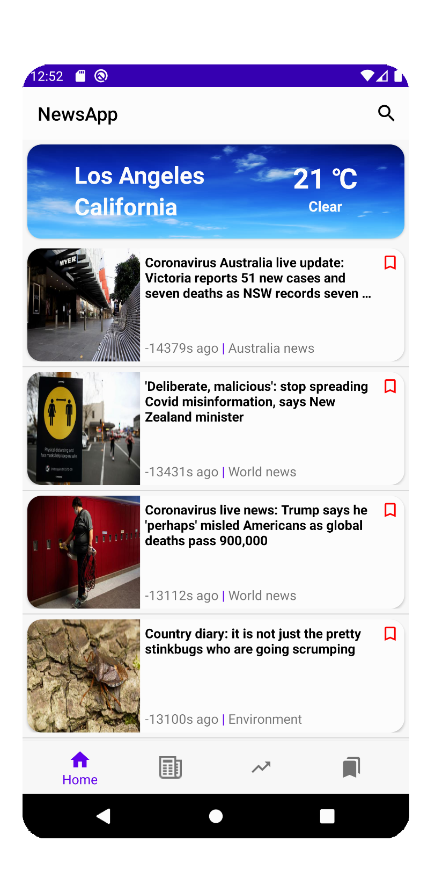
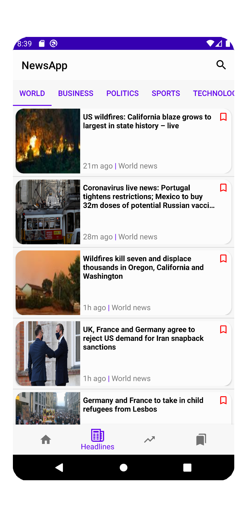
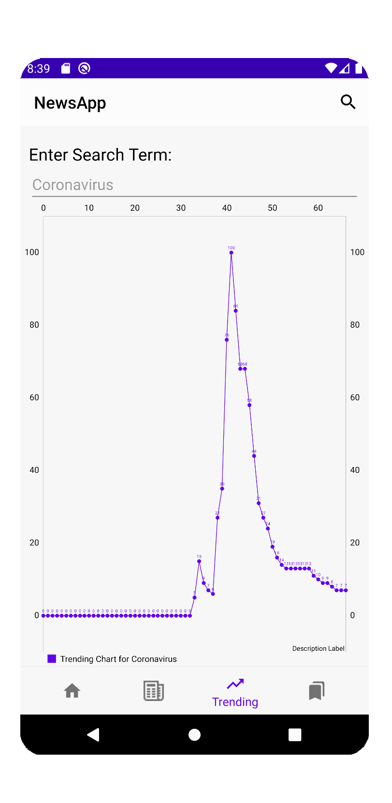
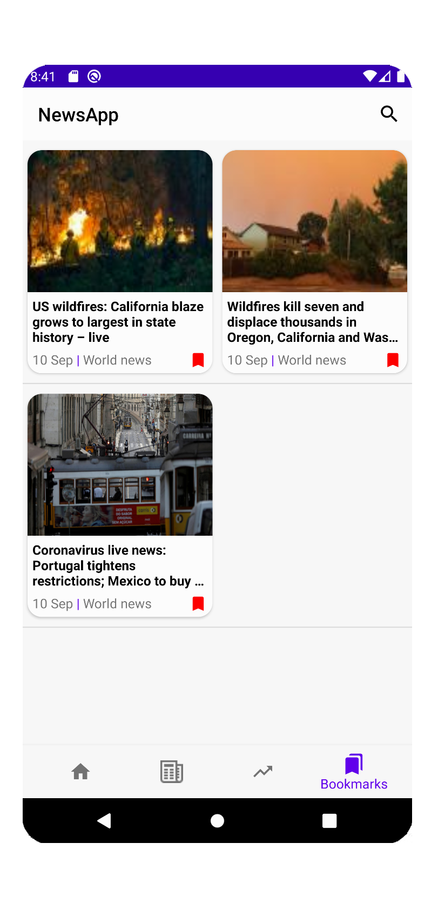

# NewsWebsite-Android-App
This is a news website mobile app build using Android Studio.
Codes are written in java.  
Backend was built with Node.js using express framework.   

   

## Table of Contents
- [Prerequisites](#Prerequisites)
- [Installation](#Installation)
- [Rebuild-project](#Rebuild-project)
- [Features](#Features)

## Prerequisites
- Node.js  
Node.js can be downloaded from <a href="https://nodejs.org/en/">https://nodejs.org/en/</a>  
- npm  
    npm can be installed using command
    ```
    sudo npm install -g npm@latest
    ```
- Android Studio  
Android studio can be downloaded from <a href="https://developer.android.com/studio">https://developer.android.com/studio</a>

## Installation
1. Clone the repository or download all files.
2. install npm packages for backend
    ```
    npm install 
    ```

## Rebuild-project 
1. Get API keys
	- 1.1 Guardian News API  
    Visit <a href="https://open-platform.theguardian.com/access/">https://open-platform.theguardian.com/access/</a>.   
    Register for developer key and on the subsequent page, enter details as asked.  
    Once you click register, a key will be emailed to you on the email address you use.  
    After receiving your API key, copy and paste the key into file "server.js" located in backend/src.
    - 1.2 Bing Autosuggest API  
    Visit <a href="https://azure.microsoft.com/en-us/services/cognitive-services/autosuggest/">https://azure.microsoft.com/en-us/services/cognitive-services/autosuggest/</a>.  
    Click "Try Bing Autosuggest" and opt for either the Free Azure account version or the existing account version. Click "create a resource" find Bing Autosuggest.  
    Click "create" and fill in the details and click "create" at the bottom (F0 is free, make sure the pricing tier is F0 if you just want to git it a try).  
    Finally, go to your resource and get your API key at "Keys and Endpoint" section.  
    Copy and paste the key into file "AutosuggestApiCall.java" located in app/src/main/java/com/example/newsapp.
    - 1.3 OpenWeather API  
    Visit <a href="https://home.openweathermap.org">https://home.openweathermap.org</a>.  
    Create a account and log in.  
    In the pop-up that asks for Company (Optional) and Purpose – select purpose as Mobile apps developments  
    Visit the API keys tab to get your API key  
    Copy and paste the key into file "OpenWeatherApiCall.java" located in app/src/main/java/com/example/newsapp.

2. Run backend  
You can choose to run backend locally or host backend on online services such as AWS, GCP and AZURE.  
The instructions below are only for running backend on local host.  
If you finish instruction 1.1 your backend is about to run.
    ```
    cd backend\src
    node server.js
    ```

3. Run the app  
    - 3.1 Get IP address (skip this if your backend is run on web servers)  
    For Windows: open terminal and input "ipconfig"  
    Fro Max: open terminal and type "ifconfig |grep inet"  
    IP address is for connectting your app with backend.    
    - 3.2 update file  
    Then, update file GuardianNewsApiCall.java and GoogleTrendsApiCall.java with your backend url.  
    If run backend locally, backend url should be "http://" + your ip address + ":" + port_number. I set port number to 3000 in backend code.
    - 3.3 start app  
    In Android Studio, create a virtual device and run the app.

## Features
1. Home tab  
    - Weather summary card of the current location is displayed.
    - A list of 10 latest news is shown in a list View.
2. Headlines tab
    - Multiple fragments allow user to swap between different categories of the news.
3. Trending tab
    - A line graph shows the popularity trend of the selected keyword over time.
4. Bookmark tab
    - All your saved news will be shown in this page.
    - Click red bookmark will delete this news from favourite list.
5. Search bar & search page
    - User can type into search box where list of suggestions will be given. Click any one of the suggestions will direct user to the search page where top 10 results will be displayed.
6. News card
    - Every news card has the same functionality.
    - Click one news card will go to article page for this news.
    - Click bookmark will mark this news as favourite and can retrieve this news later.
    - Long click on a news card, a dialog will pop up which will allow users to share it on Twitter or add it to bookmark.
7. Article page
    - Click bookmark will mark this news as favourite and can retrieve this news later.
    - Click twitter button can share this news through twitter.
    - Click "View Full Article" can goes to the original page of the news.
8. Swipe refresh
    - All news pages can be refreshed by swipe down the screen.


## Third Party libraries
1. Volley  
    Make HTTP requests.  
    References : <a href="https://developer.android.com/training/volley/index.html">https://developer.android.com/training/volley/index.html</a>
2. Picasso  
    Download and cache images.  
    References : <a href="http://square.github.io/picasso/">http://square.github.io/picasso/</a>
3. MPAAndroidChard  
    Create graph  
    References : <a href="https://github.com/PhilJay/MPAndroidChart">https://github.com/PhilJay/MPAndroidChart</a>